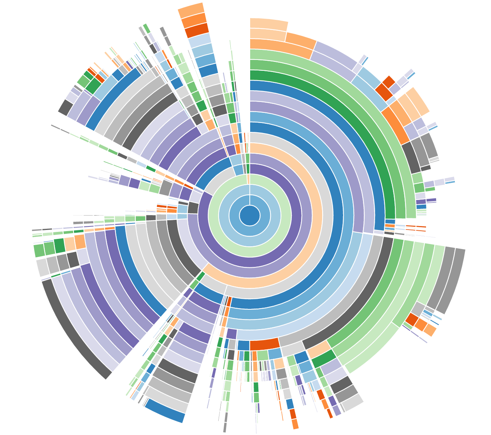

..
    This file is part of INSPIRE.
    Copyright (C) 2016 CERN.

    INSPIRE is free software: you can redistribute it and/or modify
    it under the terms of the GNU General Public License as published by
    the Free Software Foundation, either version 3 of the License, or
    (at your option) any later version.

    INSPIRE is distributed in the hope that it will be useful,
    but WITHOUT ANY WARRANTY; without even the implied warranty of
    MERCHANTABILITY or FITNESS FOR A PARTICULAR PURPOSE.  See the
    GNU General Public License for more details.

    You should have received a copy of the GNU General Public License
    along with INSPIRE. If not, see <http://www.gnu.org/licenses/>.

    In applying this licence, CERN does not waive the privileges and immunities
    granted to it by virtue of its status as an Intergovernmental Organization
    or submit itself to any jurisdiction.

Common Tasks
************

Caching
=======

For caching we use Invenio-Cache_. For example, to set a value in the cache:

.. code-block:: python

    >>> from invenio_cache import current_cache
    >>> current_cache.set('test', [1, 2, 3], timeout=60)

And to retrieve the value from the cache:

.. code-block:: python

    >>> from invenio_cache import current_cache
    >>> current_cache.get('test')

Profiling a Celery Task
=======================

To profile a Celery task we need to make sure that the task is executed by the
same Python process in which we are collecting the profiling information. That
is, the configuration must contain

.. code-block:: python

    CELERY_ALWAYS_EAGER = True
    CELERY_RESULT_BACKEND = 'cache'
    CELERY_CACHE_BACKEND = 'memory'

Then, in a Flask shell, we do

.. code-block:: python

    >>> import cProfile
    >>> import pstats
    >>> from path.to.our.task import task
    >>> pr = cProfile.Profile()
    >>> pr.runcall(task, *args, **kwargs)

where ``*args`` and ``*kwargs`` are the arguments and keyword arguments that
we want to pass to ``task``. Then

.. code-block:: python

    >>> ps = pstats.Stats(pr)
    >>> ps.dump_stats('task.prof')

will create a binary file containing the desired profiling information. To read
it we can use snakeviz_, which will create a graph such as

Essentially each layer of the graph is a level of the call stack, and the size
of the slice is the total time of the function call. For a complete explanation
visit the `documentation of snakeviz`_.

Profiling a Request
===================

To profile a request we need to add the following variable to our configuration:

.. code-block:: python

    PROFILE = True

Then we need to attach the `WSGI application profiler`_ to our WSGI application.
To do this, we need to add a few lines at the bottom of ``inspirehep/wsgi.py``:

.. code-block:: python

    import os; os.mkdir('prof')
    from werkzeug.contrib.profiler import ProfilerMiddleware
    application = ProfilerMiddleware(application, profile_dir='prof')

Now, after we restart the application, a profile report will be created in the
``prof`` folder for each request that we make. These binary files can be
visualized as above with snakeviz_.

Rebuild the assets (js/css bundles)
===================================
From the root of the code repository, you can run the helper script:

.. code-block:: bash

    $ workon inspire
    (inspire)$ ./scripts/clean_assets

This will:

1. Remove all your static assets
2. Gather all the npm dependencies and write them in the file `package.json`
   in the instance static folder
3. Execute `npm install`
4. Execute `inspirehep collect` and `inspirehep assets build`

You should then find all your updated assets in the static folder of your
inspire installation, if you are using virtualenv:

.. code-block:: bash

    cdvirtualenv var/inspirehep-instance/static/

Rebuild the database, the elasticsearch indexes, and reupload the demo records
==============================================================================
Same as the assets, from the root of the code repository, run the script:

.. code-block:: bash

    $ workon inspire
    (inspire)$ ./scripts/recreate_records

.. _`WSGI application profiler`: http://werkzeug.pocoo.org/docs/0.11/contrib/profiler/
.. _snakeviz: https://github.com/jiffyclub/snakeviz
.. _`documentation of snakeviz`: https://jiffyclub.github.io/snakeviz/#interpreting-results
.. _Invenio-Cache: https://invenio-cache.readthedocs.io/en/latest/
