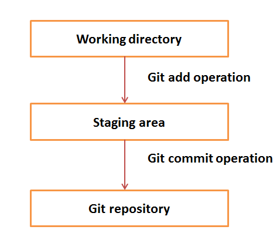

..
    This file is part of INSPIRE.
    Copyright (C) 2017 CERN.

    INSPIRE is free software: you can redistribute it and/or modify
    it under the terms of the GNU General Public License as published by
    the Free Software Foundation, either version 3 of the License, or
    (at your option) any later version.

    INSPIRE is distributed in the hope that it will be useful,
    but WITHOUT ANY WARRANTY; without even the implied warranty of
    MERCHANTABILITY or FITNESS FOR A PARTICULAR PURPOSE.  See the
    GNU General Public License for more details.

    You should have received a copy of the GNU General Public License
    along with INSPIRE. If not, see <http://www.gnu.org/licenses/>.

    In applying this licence, CERN does not waive the privileges and immunities
    granted to it by virtue of its status as an Intergovernmental Organization
    or submit itself to any jurisdiction.

=====
About
=====

Git is a distributed revision control and source code management system. It's a fast and free
software distributed under the terms of the GNU General Public License version 2.

**These are very basic instructions of git for INSPIRE and it's not a tutorial.**

========
The Idea
========

The files (code, etc.) are checked out in the working directory.
Bellow there is a basic workflow of Git.

=================
Environment Setup
=================

First of all we have to set up the git environment following the next steps.

Set up username.
Username will be used by Git for each commit.

.. code-block:: console

    git config --global user.name "name surname"

Set up email.
Email will be used by Git for each commit.

.. code-block:: console

    git config --global user.email "babis@cern.ch"

You can see what are your remotes by the following command.

.. code-block:: console

    git remote -v

Add/Remove remote.

.. code-block:: console

    git remote add <name> <url>
    git remote rm <name>

====================
Making pull requests
====================

In order to be able to contribute the project a working copy of it should be in the workspace and
then a fork of it on github.

.. code-block:: console

    git clone <url>

Before the implementation of a feature create a fresh branch and then work on top of that.

.. code-block:: console

    git checkout -b <name_of_the_branch_feature>

During the development in INSPIRE make commits by the specific change that you have done.

Commit the changes and sign it every time you commit changes by the following command.

.. code-block:: console

    git commit --signoff

Once commits are ready, rebase with the master branch and then push the changes to your remote.

.. code-block:: console

    git push <name_of_your_remote> <name_of_the_branch_feature> -f

After you have to go on github of inspire-next and there create a Pull Request (PR).
In order to create a Pull Request you have to address an Issue in general. Make it clear that you
address "Why you propose those changes" and not "How you created them".

Additionally here are some `rules
<https://github.com/inveniosoftware/invenio/blob/master/CONTRIBUTING.rst>`_ about contributing.

===============
Useful commands
===============

Fetch changes from a remote, and then you can rebase your branch.

.. code-block:: console

    git fetch <remote_name>

Rebase code and edit, drop, squash, pick and reword commits.

.. code-block:: console

    git rebase -i <remote_name>/<branch_name>

Chery pick a specific commit.

.. code-block:: console

    git chery-pick <identifier_code_of_commit>

============
More details
============

Some useful links are listed bellow:

`Official documentation
<https://git-scm.com/book/en/v2/>`_

`Git branching
<http://learngitbranching.js.org/>`_

`Useful Tutorial
<https://codewords.recurse.com/issues/two/git-from-the-inside-out>`_
