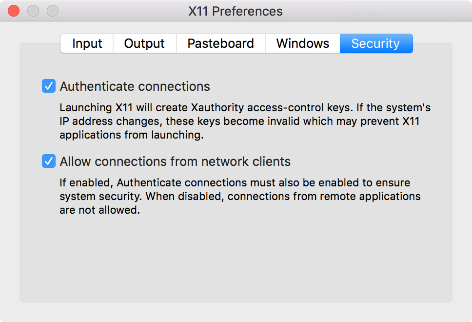
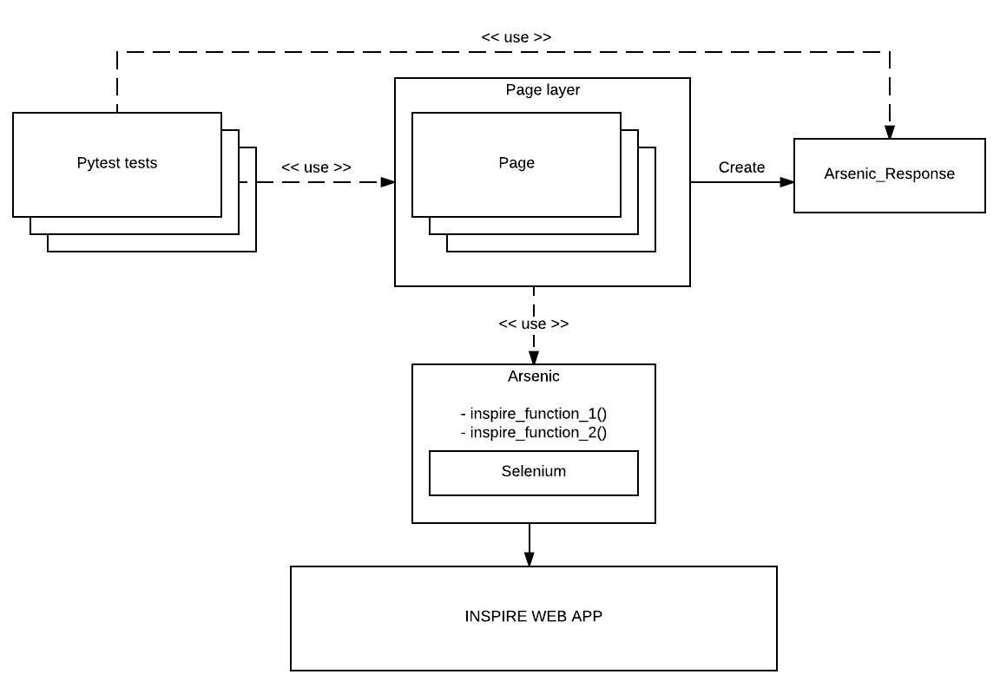

..
    This file is part of INSPIRE.
    Copyright (C) 2015, 2016, 2017 CERN.

    INSPIRE is free software: you can redistribute it and/or modify
    it under the terms of the GNU General Public License as published by
    the Free Software Foundation, either version 3 of the License, or
    (at your option) any later version.

    INSPIRE is distributed in the hope that it will be useful,
    but WITHOUT ANY WARRANTY; without even the implied warranty of
    MERCHANTABILITY or FITNESS FOR A PARTICULAR PURPOSE.  See the
    GNU General Public License for more details.

    You should have received a copy of the GNU General Public License
    along with INSPIRE. If not, see <http://www.gnu.org/licenses/>.

    In applying this licence, CERN does not waive the privileges and immunities
    granted to it by virtue of its status as an Intergovernmental Organization
    or submit itself to any jurisdiction.

Inspire Tests
=============

How to Run the Selenium Tests
-----------------------------

Via Docker
~~~~~~~~~~

1. If you have not installed ``docker`` and ``docker-compose``, `install them now`_.

.. _install them now: https://github.com/inspirehep/inspire-next/pull/1015

2. Run ``docker``:

.. code-block:: bash

  $ docker-compose -f docker-compose.test.yml run --rm acceptance

Via Docker with a graphical instance of Firefox (Linux)
~~~~~~~~~~~~~~~~~~~~~~~~~~~~~~~~~~~~~~~~~~~~~~~~~~~~~~~

1. Check the first step in the `Via Docker`_ section.

2. Add the root user to the list allowed by **X11**:

.. code-block:: bash

  $ xhost local:root
  non-network local connections being added to access control list

3. Run ``docker``:

.. code-block:: bash

  $ docker-compose -f docker-compose.test.yml run --rm visible_acceptance

Via Docker with a graphical instance of Firefox (macOS)
~~~~~~~~~~~~~~~~~~~~~~~~~~~~~~~~~~~~~~~~~~~~~~~~~~~~~~~

1. Check the first step in the `Via Docker`_ section.

2. Install **XQuartz**: go to the `XQuartz website`_ and install the latest version.
   In alternative, run:

.. code-block:: bash

  $ brew cask install xquartz

.. _`XQuartz website`: https://www.xquartz.org/

3. Having installed **XQuartz**, run it and open the **XQuartz** ->
   **Preferences** menu from the bar. Go to the last tab, **Security**, enable
   both the **"Authenticate connections"** and **"Allow connections from network
   clients"** checkboxes, then restart your computer.

4. Write down the IP address of your computer because you will need it later:

.. code-block:: bash

  $ ifconfig en0 | grep inet | awk '$1=="inet" {print $2}'
  123.456.7.890

5. Add the IP address of your computer to the list allowed by **XQuartz**:

.. code-block:: bash

  $ xhost + 123.456.7.890
  123.456.7.890 being added to access control list

6. Set the ``$DISPLAY`` environment variable to the same IP address, followed by
   the id of your display (in this case, ``:0``):

.. code-block:: bash

  $ export DISPLAY=123.456.7.890:0

7. Run ``docker``:

.. code-block:: bash

  $ docker-compose -f docker-compose.test.yml run --rm visible_acceptance

How to Write the Selenium Tests
-------------------------------

Selenium Test Framework
~~~~~~~~~~~~~~~~~~~~~~~

INSPIRE's Selenium tests are written using an in-house framework called BAT
(:file:`inspirehep/bat`). The framework is made of four main components:

- `Tests`
- `Pages`
- `Arsenic`
- `ArsenicResponse`

Tests
~~~~~

Tests don't call directly Selenium methods, but call methods on `Pages`, which
are eventually translated to Selenium calls.

Tests are intended to be imperative descriptions of what the user does and what
they expect to see. For example

.. code-block:: python

    def test_mail_format(login):
        create_author.go_to()
        assert create_author.write_mail('wrong mail').has_error()
        assert not create_author.write_mail('me@me.com').has_error()

asserts that, when the user visits the "Create Author" page and writes ``wrong
mail``, they see an error, while when they visit the same page but write a valid
email, they don't see it.

Pages
~~~~~

Pages are abstractions of web pages served by INSPIRE. Concretely, a page is a
collection of methods in a module that implement the various action that a user
can take when interacting with that page. For example the

.. code-block:: python

    def go_to():
        Arsenic().get(os.environ['SERVER_NAME'] + '/authors/new')

method in :file:`inspirehep/bat/pages/create_author.py` represents the action of
visiting the "Create Author" page, while

.. code-block:: python

    def write_institution(institution, expected_data):
        def _write_institution():
            return expected_data in Arsenic().write_in_autocomplete_field(
                'institution_history-0-name', institution)

        return ArsenicResponse(_write_institution)

in the same module represents the action of filling the autocomplete field
of id ``institution_history-0-name`` with the content of the ``institution``
variable.

Note that the latter method returns a closure over ``expected_data`` and
``institution`` which is going to be used by an ``has_error`` call to determine
if the action was successful or not.

Arsenic
~~~~~~~

The ``Arsenic`` class is a proxy to the Selenium object, plus some
INSPIRE-specific methods added on top.

ArsenicResponse
~~~~~~~~~~~~~~~

As mentioned above, an ``ArsenicResponse`` wraps a closure that is going to be
used by an ``has_error`` call to determine if the action executed
successfully.

How to Debug the Selenium Tests
-------------------------------

Unlike the other test suites, the container that is running the test code of the
``acceptance`` test suite is different from the one running the application
code. Therefore, in order to debug a test failure, we must connect remotely to
this other container. The tool to achieve this is called `remote-pdb`_. This
section explains how to use it.

1. First we install it in the container:

.. code-block:: bash

   $ docker-compose run --rm web pip install remote-pdb

2. Then we insert the following code where we want to start tracing:

.. code-block:: python

  from remote_pdb import RemotePdb
  RemotePdb('0.0.0.0', 4444).set_trace()

3. Now we run the ``acceptance`` test suite:

.. code-block:: bash

  $ docker-compose -f docker-compose.test.yml run --rm acceptance

4. At some point the test suite will stop: it means that we have hit the tracing
   call. We discover the IP of the ``web`` container with:

.. code-block:: bash

  $ docker inspect inspirenext_test-web_1 | grep IPAddress
  [...]
  "IPAddress": "172.18.0.6"

5. Finally, we connect to it with:

.. code-block:: bash

  $ telnet 172.18.0.6 4444

.. _`remote-pdb`: https://pypi.python.org/pypi/remote-pdb
